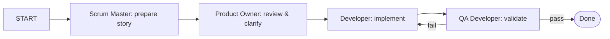

**TL;DR:** I compared Claude Sonnet 4.5, Codex, and Gemini 2.5 Pro/Flash on the
same development workflow. This post covers how I set up the experiment and
what I was trying to learn.

## The Goal

AI agents can dramatically accelerate software development. But with several
models now offering "coding assistant" modes, which one should you trust to run
an actual Agile workflow? To avoid switching tools daily, I ran a controlled
test comparing **Claude Sonnet 4.5**, **Codex (gpt‑5‑codex)**, and
**Gemini 2.5 Pro/Flash** under the same conditions.

I didn't just want to see who "wins." I wanted to understand how to **get the
best out of them**: what makes one model stumble, and how to structure my work
to make them succeed.

## The BMAD Method

I used the open-source [BMAD method](https://github.com/bmad-code-org/BMAD-METHOD),
which defines repeatable "agent personas" (Product Owner, Scrum Master,
Architect, Developer, QA, and so on) that can be used inside different AI CLIs.
Each persona has its own prompt context and tasks. BMAD can install directly
into your project:

```bash
$ npx bmad-method install
```

After a few setup questions, it configures all three CLIs (Claude, Codex,
Gemini) with identical agent commands like `/bmad:agents:sm` or
`/bmad:tasks:create-next-story`. The result: a consistent sandbox for comparing
how each model behaves with the same project structure.

<details markdown="1">
<summary>Example: Activating the Scrum Master agent</summary>

```text
> /bmad:agents:sm
🏃 Bob - Scrum Master Activated
Ready to assist! What would you like me to do?
```

</details>

## The Test Project

To keep things realistic, I used my in-progress project **Squirrel**, a
"production‑ready" rewrite of a [previous toy
app](/2025/08/20/pdf-store-app-with-gemini.html) that stores PDFs. Unlike the
earlier version, which had a single endpoint and simple data flow, this story
spans multiple services (Rust API, Python worker, and integration tests) making
it a much stronger test of each model’s reasoning and consistency. The goal was
to implement **Story 2.2**, a worker endpoint that fetches and cleans web
articles. It's a perfect mid‑development test: it spans backend, worker logic,
and integration tests.

<details markdown="1">
<summary>Story 2.2 PRD Summary</summary>

**As a system**, I want the Python worker to fetch web article URLs and extract
clean content using newspaper4k, so that users can read articles offline.

**Acceptance Criteria** (abridged):

1. Fetch article with metadata.
2. Parse content via `newspaper4k`.
3. Store extracted data in PostgreSQL.
4. Handle failures gracefully.
5. Add integration tests verifying successful extraction.
</details>

## The Workflow

Each model went through the same four roles sequentially:



I triggered each phase manually, letting the agent hand off to the next. When it
got stuck (usually in tests), I gave minimal hints: just enough to keep parity
across models.

To keep the playing field level, I **disabled all external MCP servers and
plugins**. Each agent relied purely on its internal reasoning and the provided
project files.

This setup ensured that each model faced identical constraints. No hidden
context, no external tools; just reasoning and code.

## What's Next

In **Part 2**, I'll share the quantitative and qualitative results: how many
lines of code each added, where they excelled, and which one I'd actually use
day‑to‑day.

If you'd like to follow the full series:

- [**Part 1 (this post)**](/2025/11/01/ai-agent-comparison-part-1.html): Setup and methodology
- [**Part 2**](/2025/11/01/ai-agent-comparison-part-2.html): Results and analysis
- [**Part 3**](/2025/11/01/ai-agent-comparison-part-3.html): Why asking the model to _reason_ changed everything
