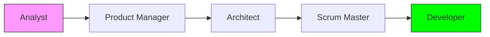

<figure>

<figcaption>Use agents not just as a coworker, but a ladder.</figcaption>
</figure>

I’ve been playing with a lot of agentic frameworks at home and at work. There
are lots of pages with feedback on agents (example: [learnings from the
sourcegraph team](https://www.nibzard.com/ampcode)) and tons of tried and true
[agentic patterns](https://agentic-patterns.com/) out there.

What is an agent? More or less, it’s defined as [^1]:

> A system designed to perceive its environment, reason about how to achieve a
> specific goal, and then take actions to complete it, often with little to no
> human intervention.

So, this is not just an LLM that responds with text, but one with access to
tools like web search or code execution. However, as I’ve experimented with
these frameworks, I've realized we are facing **The Operator’s Dilemma**: the
more efficient our agents become at "doing," the more passive we become as
observers. If we aren't careful, we risk becoming mere button-pushers, losing
the very skills that made us capable of directing the agents in the first place.

I found myself asking one constant question:

> **_How can I use agents so that I, as the operator, also grow?_**

These are some tips I’ve learned to put the emphasis on self-growth rather than
just raw productivity. Our brain has an impressive capacity to learn, and by
offloading the "thinking" without a strategy, we waste that capacity.

To keep this engaging, I've added suggestions you can try yourself. You can
follow along by just opening a few free [Gemini](https://gemini.google.com/) or
[ChatGPT](https://chatgpt.com/) sessions.

> **NOTE**: I have decided to stick to one set of prompts throughout this post
> from the [BMAD method](https://github.com/bmad-code-org/BMAD-METHOD), named
> after its creator Brian Madison. I use BMAD because
> it mirrors a professional software development lifecycle (SDLC) more closely
> than any other framework I’ve found. If you use these prompts, please
> attribute them to the author, Brian Madison.

[^1]:
    This was taken from
    [geeks2geeks](https://www.geeksforgeeks.org/artificial-intelligence/agents-artificial-intelligence/).

---

## Separate By Scale And Stage, Not Expertise

I’ve found that trying to separate agents by expertise (e.g., "The Python Expert") tends to limit them. If you think about it, it doesn’t make sense. If you ask an astrobiologist a question, asking them to "pretend they only know astronomy" doesn't help you; it just restricts the resources they can draw upon.

Conversely, allowing an agent to traverse _scale_ is counter to how we think. We don't try to understand how a car works by thinking about the molecular structure of rubber tires at the same time we're thinking about the steering rack. We want the agent to be as knowledgeable as possible, but focused on the right **scale**.

### The Multi-Stage Flow

In software, we handle this by moving through specific stages. This prevents the "Developer" agent from getting bogged down in "Product" questions.

**BMAD Scale Example:**
When working on a product, we start with the overall goal (The [Product Manager](https://github.com/bmad-code-org/BMAD-METHOD/blob/v4.44.3/dist/agents/pm.txt) writing a PRD). We then move to high-level structure and constraints (The [Architect](https://github.com/bmad-code-org/BMAD-METHOD/blob/v4.44.3/dist/agents/architect.txt)). Only after the high-level picture is clear do we funnel down into specific tasks (The [Scrum Master](https://github.com/bmad-code-org/BMAD-METHOD/blob/v4.44.3/dist/agents/sm.txt)) and final execution (The [Developer](https://github.com/bmad-code-org/BMAD-METHOD/blob/v4.44.3/dist/agents/dev.txt)).

Agents don't "remember" well across massive contexts [^2], so writing things down at each scale and passing those documents to the next stage is critical.

> **Try this**: Copy/paste these prompts in different sessions in order. At the end of each session, have the previous agent write a "handover doc" for the next one.
> [Analyst](https://github.com/bmad-code-org/BMAD-METHOD/blob/v4.44.3/dist/agents/analyst.txt) → [Product Manager](https://github.com/bmad-code-org/BMAD-METHOD/blob/v4.44.3/dist/agents/pm.txt) → [Architect](https://github.com/bmad-code-org/BMAD-METHOD/blob/v4.44.3/dist/agents/architect.txt)

[^2]:
    As a matter of fact, newer models have been suspected of being [aware of
    their own context
    window](https://cognition.ai/blog/devin-sonnet-4-5-lessons-and-challenges#the-model-is-aware-of-its-context-window) hurting their performance. This is
    a phenomenon currently coined as "[context
    anxiety](https://agentic-patterns.com/patterns/context-window-anxiety-management/)".

---

## Always Use a Verifier Agent

For every agent performing a task, use a **Verifier Agent** to check the work. To avoid "sunk cost bias" or the agent simply agreeing with itself, the Verifier must follow three rules:

1. Must start from a **fresh context** (a new chat).
2. Must not see the private "thought process" of the first agent.
3. Must have a specific prompt focused on finding flaws.

This mimics the real-world "fresh pair of eyes" effect.

**Examples from BMAD:**

- [Scrum Master](https://github.com/bmad-code-org/BMAD-METHOD/blob/v4.44.3/dist/agents/sm.txt) verified by [Product Owner](https://github.com/bmad-code-org/BMAD-METHOD/blob/v4.44.3/dist/agents/po.txt).

- [Developer](https://github.com/bmad-code-org/BMAD-METHOD/blob/v4.44.3/dist/agents/dev.txt) verified by [QA Agent](https://github.com/bmad-code-org/BMAD-METHOD/blob/v4.44.3/dist/agents/qa.txt).

---

## Automate Only The Scale You’re Comfortable With

When starting, it’s tempting to let agents run wild. This is almost always a mistake. You will quickly lose understanding of the product being built. Instead, think of the agent as a **facilitator**.

The line of automation should meet your level of expertise. If you let an agent write code you don't understand, you aren't growing; you're just accumulating technical debt you can't pay off. I categorize agents into three levels:

### 1. Q&A Helper Agent

An agent you ask at least 10 questions a day. Even if you think you know the answer, ask. This is about discovering "what you don't know you don't know."

> **Try this**: Ask an agent "How does transmission fluid work?" or "Why do stars twinkle but planets don't?" Then (and this is the important part) ask **two follow-up questions** about the mechanics.

### 2. Facilitator Agent

These agents brainstorm and ask _you_ questions. They help pull the best ideas out of your head.

> **Try this**: Use the [Analyst Agent](https://github.com/bmad-code-org/BMAD-METHOD/blob/v4.44.3/dist/agents/analyst.txt) and tell it you want to build a new app. See how it challenges your assumptions.

### 3. Autonomous Execution Agent

The agent that does the work. Junior developers should use this sparingly (mostly code completion). Senior developers can offload larger chunks of routine tasks.

> **Try this**: Ask an agent to write a Python script for a unicorn maze. **Crucially:** Ask the agent to explain the logic behind the pathfinding algorithm it used so you understand the "why" behind the code.

---

## Keep It Simple

Unless you’re shipping a product, cap your "workflow improvement" time to
**10%**. The [Bitter
Lesson](http://www.incompleteideas.net/IncIdeas/BitterLesson.html) teaches us
that general methods usually win over complex, hand-tuned workflows.

If you spend all your time developing a grand workflow, you risk:

1. Being superseded by a simpler, native LLM update.
2. Creating a system so complex you never actually use it for real work.

---

## Closing Thoughts

We are at a pivotal moment. We have tools that can think on scales that handle the mundane, enabling us to maximize our learning. But if used incorrectly to simply "finish the work" our cognitive skills will decline.

A [recent study](https://www.media.mit.edu/projects/your-brain-on-chatgpt/overview/) found that users who used ChatGPT to write essays became "metacognitively lazy." However, the group that practiced **without** AI first, and then used AI, performed significantly better.

This leads to what I call **The Agentic Ladder**:

1. **Master the skill manually** so you have a solid footing.
2. **Use the agent** to launch you to the next rung of complexity.
3. **Repeat.**

If you start on a rung you haven't mastered, you have no footing, and the agent is carrying you. The goal isn't to build a better agent; it's to use the agent to build a better version of yourself.

Remember, you are the driver, and where you're headed is within your control!
